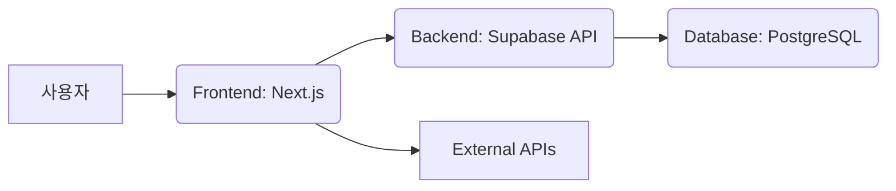

# Technical Requirements Document (TRD)

## 1. Executive Technical Summary
- **Project Overview**: 전국 아파트 정보를 통합 검색하고 제공하는 웹 서비스 개발. 사용자에게 필요한 정보를 쉽고 빠르게 제공하며, 부동산 중개사를 위한 B2B 라이선스 모델을 지원한다.
- **Core Technology Stack**: Next.js 15 (TypeScript), TailwindCSS, shadcn, lucide-react, Supabase, @tanstack/react-query, date-fns, es-toolkit을 사용하여 빠르고 효율적인 웹 애플리케이션을 구축한다.
- **Key Technical Objectives**: 빠른 검색 속도(3초 이내), 사용자 친화적인 인터페이스, 높은 트래픽 처리 능력, 데이터 최신성 유지, 안정적인 B2B 라이선스 시스템 구축을 목표로 한다.
- **Critical Technical Assumptions**: 전국 아파트 정보 데이터베이스가 Supabase에 구축되어 있으며, API를 통해 접근 가능하다는 전제하에 개발을 진행한다. 공공 데이터베이스 사용 근거 및 저작권 문제를 해결해야 한다.

## 2. Tech Stack

| Category          | Technology / Library        | Reasoning (Why it's chosen for this project) |
| ----------------- | --------------------------- | -------------------------------------------- |
| Framework         | Next.js 15                  | 서버 사이드 렌더링(SSR) 및 정적 사이트 생성(SSG) 지원, 초기 로딩 속도 개선 및 SEO 최적화. 빠른 개발 속도 및 확장성 제공 |
| Language          | TypeScript                  | 타입 안정성 강화, 코드 품질 향상, 유지보수 용이 |
| UI Framework      | TailwindCSS                 | 유틸리티 기반 CSS 프레임워크, 빠른 스타일링 및 일관성 유지 |
| UI Components     | shadcn                      | 재사용 가능한 UI 컴포넌트 제공, 개발 생산성 향상 및 디자인 시스템 유지 |
| Icon Library      | lucide-react                | 고품질 아이콘 제공, UI 일관성 및 사용자 경험 향상 |
| Database          | Supabase (PostgreSQL)       | 확장성, 안정성, 실시간 데이터 처리 지원, 비용 효율적 |
| Data Fetching     | @tanstack/react-query       | 효율적인 데이터 fetching 및 캐싱, 사용자 경험 향상 |
| Utility Library   | es-toolkit                  | 다양한 유틸리티 함수 제공, 개발 편의성 증대 |
| Date Manipulation | date-fns                    | 날짜 및 시간 관련 기능 제공, 정확하고 효율적인 날짜 처리 |

## 3. System Architecture Design

### Top-Level building blocks
- **Frontend (Next.js Application)**:
    - 사용자 인터페이스 및 상호 작용 처리
    - 컴포넌트 기반 아키텍처 (shadcn 활용)
    - 서버 사이드 렌더링 (SSR) 및 정적 사이트 생성 (SSG)
    - 하위 빌딩 블록: UI 컴포넌트, 페이지 라우팅, 상태 관리, API 호출
- **Backend (Supabase)**:
    - 데이터베이스 관리 (PostgreSQL)
    - API 엔드포인트 제공 (Supabase Functions)
    - 사용자 인증 및 권한 관리
    - 하위 빌딩 블록: 데이터 모델, API 엔드포인트, 인증 로직, 데이터 처리 로직
- **External APIs**:
    - 공공 데이터 포털 API 연동 (아파트 정보)
    - 실시간 뉴스 API 연동 (차후 버전)
    - 하위 빌딩 블록: API 클라이언트, 데이터 파싱 로직, 에러 처리 로직

### Top-Level Component Interaction Diagram



- 사용자는 Frontend (Next.js)를 통해 서비스에 접근하고 검색 및 상세 정보 요청을 수행합니다.
- Frontend는 Backend (Supabase API)에 API 요청을 보내 데이터베이스에 접근합니다.
- Backend는 데이터베이스 (PostgreSQL)에서 필요한 데이터를 조회하고 Frontend에 응답합니다.
- Frontend는 External APIs를 통해 외부 데이터를 가져와 사용자에게 제공합니다.

### Code Organization & Convention
**Domain-Driven Organization Strategy**
- **Domain Separation**: 사용자 관리, 아파트 정보 관리, 검색 기능 등으로 도메인 분리
- **Layer-Based Architecture**: UI 컴포넌트, 비즈니스 로직, 데이터 접근 레이어로 분리
- **Feature-Based Modules**: 각 기능별 모듈 (예: 검색, 상세 페이지, 비교 차트)
- **Shared Components**: 공통 UI 컴포넌트, 유틸리티 함수, 타입 정의

**Universal File & Folder Structure**
```
/
├── components/             # 재사용 가능한 UI 컴포넌트
│   ├── ApartmentCard.tsx     # 아파트 정보 카드 컴포넌트
│   ├── SearchBar.tsx         # 검색 바 컴포넌트
│   └── ...
├── pages/                  # Next.js 페이지
│   ├── index.tsx           # 메인 페이지 (검색)
│   ├── apartments/
│   │   └── [id].tsx        # 아파트 상세 페이지
│   └── ...
├── services/               # API 호출 및 데이터 처리 로직
│   ├── apartmentService.ts # 아파트 정보 관련 API 호출
│   └── ...
├── utils/                  # 유틸리티 함수
│   ├── dateUtils.ts        # 날짜 관련 유틸리티
│   └── ...
├── types/                  # TypeScript 타입 정의
│   ├── Apartment.ts        # 아파트 정보 타입
│   └── ...
├── styles/                 # CSS 스타일 (TailwindCSS)
│   ├── globals.css         # 전역 스타일
│   └── tailwind.config.js  # TailwindCSS 설정
├── public/                 # 정적 파일 (이미지, 폰트 등)
├── .env.local              # 환경 변수
├── tsconfig.json           # TypeScript 설정
└── package.json            # 프로젝트 설정
```

### Data Flow & Communication Patterns
- **Client-Server Communication**: Next.js API Routes를 통해 클라이언트와 서버 간 통신
- **Database Interaction**: Supabase 클라이언트를 사용하여 PostgreSQL 데이터베이스에 접근
- **External Service Integration**: Axios 또는 Fetch API를 사용하여 외부 API 호출
- **Data Synchronization**: @tanstack/react-query를 사용하여 서버 상태 관리 및 데이터 동기화

## 4. Performance & Optimization Strategy
- Next.js의 SSR 및 SSG 기능을 활용하여 초기 로딩 속도 최적화
- 이미지 최적화 및 Lazy Loading 적용
- @tanstack/react-query를 사용하여 API 응답 캐싱
- 데이터베이스 쿼리 최적화 및 인덱싱
- CDN을 사용하여 정적 자산 배포

## 5. Implementation Roadmap & Milestones
### Phase 1: Foundation (MVP Implementation)
- **Core Infrastructure**: Next.js 프로젝트 설정, Supabase 데이터베이스 구축, 기본 UI 컴포넌트 개발
- **Essential Features**: 전국 아파트 검색 기능, 아파트 기본 정보 상세 보기 기능, 정보 의미 툴팁 기능
- **Basic Security**: 사용자 인증 및 권한 관리 (Supabase Auth 활용)
- **Development Setup**: 개발 환경 설정, CI/CD 파이프라인 구축 (GitHub Actions)
- **Timeline**: 3주

### Phase 2: Feature Enhancement
- **Advanced Features**: 단지 비교 차트 기능, 관심 단지 즐겨찾기 기능
- **Performance Optimization**: 시스템 성능 개선 및 코드 최적화
- **Enhanced Security**: 보안 취약점 점검 및 개선, 데이터 암호화
- **Monitoring Implementation**: 서비스 모니터링 시스템 구축 (Supabase Observability 활용)
- **Timeline**: 4주

## 6. Risk Assessment & Mitigation Strategies
### Technical Risk Analysis
- **Technology Risks**: Supabase 및 Next.js 관련 기술적 문제 발생 가능성
    - **Mitigation Strategies**: Supabase 및 Next.js 공식 문서 및 커뮤니티 활용, 기술 지원 계약
- **Performance Risks**: 데이터 증가에 따른 검색 성능 저하 가능성
    - **Mitigation Strategies**: 데이터베이스 인덱싱, 캐싱 전략, 코드 최적화
- **Security Risks**: 데이터 유출 및 해킹 시도 가능성
    - **Mitigation Strategies**: 데이터 암호화, 보안 취약점 점검, 접근 제어 강화
- **Integration Risks**: 외부 API 연동 실패 가능성
    - **Mitigation Strategies**: API 사용량 제한 설정, 에러 처리 로직 구현, 대체 API 확보

### Project Delivery Risks
- **Timeline Risks**: 개발 일정 지연 가능성
    - **Contingency Plans**: 우선순위 재조정, 추가 개발 인력 투입
- **Resource Risks**: 개발 인력 부족 가능성
    - **Contingency Plans**: 외부 개발 업체 활용, 팀 내 기술 교육 강화
- **Quality Risks**: 코드 품질 저하 가능성
    - **Contingency Plans**: 코드 리뷰 강화, 자동화 테스트 도입
- **Deployment Risks**: 배포 과정 중 문제 발생 가능성
    - **Contingency Plans**: 배포 전 충분한 테스트, 롤백 전략 수립
